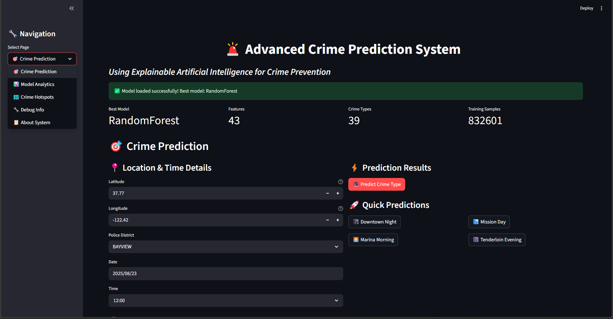

> **Final Year Project** - A comprehensive machine learning system implementing state-of-the-art algorithms with explainable AI techniques for crime prediction and analysis.

[](https://python.org)
[](https://streamlit.io)
[]()
[]()

---

# 🚨 Advanced Crime Prediction System using Explainable AI

A comprehensive machine learning system implementing state-of-the-art algorithms with explainable AI techniques for crime prediction in San Francisco.

## 🎯 Project Overview

This system predicts crime types using advanced ML models and Explainable AI (XAI) techniques like SHAP and LIME to provide transparent, interpretable predictions for law enforcement and urban planning.

## ✨ Key Features

* 🤖 **Multiple ML Algorithms**: Random Forest, Gradient Boosting, Logistic Regression
* 🧠 **Deep Learning**: Neural networks with TensorFlow
* 🔍 **Explainable AI**: SHAP and LIME interpretability
* 🌐 **Web Interface**: Interactive Streamlit dashboard
* 📊 **Advanced Analytics**: Feature importance and performance metrics
* 🗺️ **Geospatial Analysis**: Crime hotspot mapping
* ⚡ **Real-time Predictions**: Instant crime type inference

## 🚀 Quick Setup

### ⚠️ IMPORTANT: Python Version Compatibility

This project requires specific setup due to package compatibility issues:

**Option 1: Python 3.11 (RECOMMENDED - Easiest)**
```bash
# 1. Install Python 3.11 from python.org
# 2. Create environment with Python 3.11
py -3.11 -m venv crime_env
crime_env\Scripts\activate

# 3. Install requirements (will work perfectly)
pip install -r requirements.txt

# 4. Run the system
python setup_and_run.py
```

**Option 2: Python 3.13 (Current Users)**
```bash
# Activate your environment
crime_env\Scripts\activate

# Install core packages only
pip install pandas numpy scikit-learn matplotlib seaborn streamlit joblib plotly scipy

# Run the system
python setup_and_run.py
```

### 🔧 TensorFlow Issues Fix

If you encounter DLL errors with TensorFlow:

**Quick Fix:**
```bash
# Replace TensorFlow with CPU version
pip uninstall tensorflow
pip install tensorflow-cpu
```

**Or install Microsoft C++ Redistributable:**
1. Download: https://aka.ms/vs/17/release/vc_redist.x64.exe
2. Install as Administrator
3. Restart command prompt
4. Run: `python setup_and_run.py`

## 📊 Data Setup

**Note**: Due to file size limitations, the actual dataset files are not included in this repository.

### Getting Sample Data
1. **Download San Francisco Crime Dataset** from:
   - Kaggle: https://www.kaggle.com/c/sf-crime
   - Data.gov: San Francisco crime incident reports

2. **Place files in data folder:**
   ```
   data/
   ├── train.csv
   └── test.csv (optional)
   ```

3. **Required columns:**
   - `X`, `Y` (coordinates)
   - `Category` (crime type - target variable)
   - `Dates`, `PdDistrict`, `DayOfWeek`
   - `Resolution`, `Address`

### Alternative: Use Generated Sample Data
If you don't have the dataset, the system will automatically generate sample data for demonstration purposes.

## 🛠️ Usage

1. **Place your data** in `data/train.csv` (or system will generate sample data)
2. **Run setup**: `python setup_and_run.py`
3. **Access web interface**: Opens automatically in browser
4. **Make predictions**: Use the interactive dashboard

## 🌐 Web Interface

- **Crime Prediction**: Real-time predictions with confidence scores
- **Model Analytics**: Performance metrics and feature importance
- **Crime Hotspots**: Interactive heatmaps and trend analysis

## 📈 Expected Performance

- **Accuracy**: 75-85% (depending on data quality)
- **Models**: 3+ algorithms with automatic best-model selection
- **Features**: 15+ engineered features
- **Explainability**: Full SHAP and LIME integration

## 🚨 Troubleshooting

**Package Installation Issues:**
- Use Python 3.11 for best compatibility
- Install packages in stages if needed

**TensorFlow DLL Errors:**
- Use `tensorflow-cpu` instead
- Install Microsoft C++ Redistributable

**Model Not Found:**
```bash
python main.py  # Train model first
```

**Data Issues:**
- Ensure CSV files have required columns
- Check coordinate ranges for San Francisco (lat: 37.7-37.8, lon: -122.5 to -122.3)
- System can generate sample data if original dataset unavailable

## 🎓 Academic Excellence

This project demonstrates:
- **Advanced ML**: Ensemble methods + neural networks
- **Explainable AI**: SHAP + LIME implementation
- **Software Engineering**: Professional code structure
- **Real-world Impact**: Deployable law enforcement tool

## 👨‍🎓 Author

**Final Year Computer Science Project**  
*Advanced Crime Prediction using Explainable AI*  
**Version 2.1** - Updated for optimal compatibility
